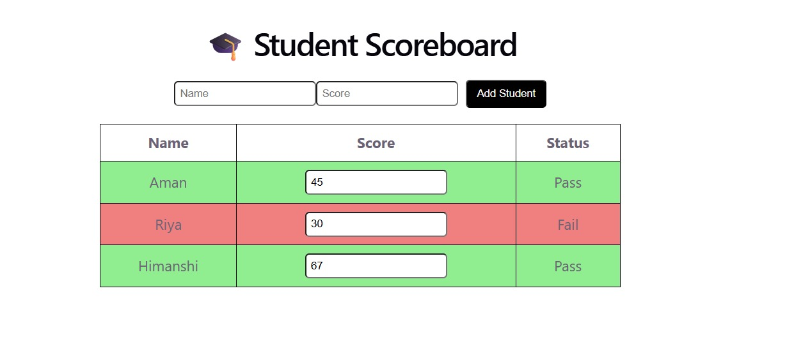

# 🎓 Student Scoreboard (React)

## 📌 Description

This is a React-based Student Scoreboard application where users can manage student marks easily.
It allows adding students, updating scores, and viewing pass/fail status dynamically.

---

## 🚀 Features

* 📊 Display student list with scores
* ✏️ Update scores in real-time
* ➕ Add new students using a form
* ✅ Pass/Fail status:

  * Pass → score ≥ 40
  * Fail → score < 40
* 🎨 Clean UI with CSS styling

---

## 🛠️ Technologies Used

* React (Vite)
* JavaScript (JSX)
* CSS

---

## 📁 Project Structure

src/
├── components/
│ ├── Header.jsx
│ ├── StudentTable.jsx
│ ├── StudentRow.jsx
│ ├── AddStudentForm.jsx
├── App.jsx
├── App.css
├── main.jsx

---

## ▶️ How to Run

1. Install dependencies:
   npm install

2. Start development server:
   npm run dev

3. Open in browser:
   http://localhost:5173/

---

## 🌐 Live Demo

(Add your Netlify link here)

---

## 📸 Screenshot

---

## 👨‍💻 Author

Gungun Srivastav

This project is created as part of Web Development II (React) Lab Assignment.

